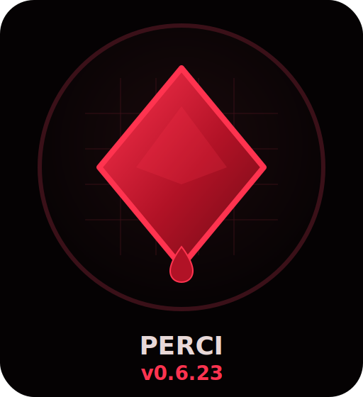
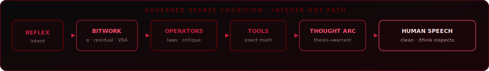

# PERCI

<p align="center">
  
</p>

<p align="center">
  
  &nbsp;&nbsp;
  
</p>

<p align="center">
  <strong>Local, governed, sparse cognition.</strong><br>
  Not a cloud LLM. Not a pretend mind.<br>
  A Rust stack that <em>routes in bits, thinks in operators, and speaks like a collaborator</em> —
  while showing its work when you ask.
</p>

<p align="center">
  
  
  
  
  
  
</p>

<p align="center">
  <a href="https://github.com/jacksonjp0311-gif/Perci"><strong>github.com/jacksonjp0311-gif/Perci</strong></a>
</p>

---

<p align="center">
  
</p>

## What is Perci?

Perci is an experimental **cognitive OS for one machine**. It separates jobs that most assistants bury inside one opaque model:

| Piece | What it does |
|-------|----------------|
| **Bitwork** | Sparse binary field (~200 MiB pack) — routes and geometry, not full language |
| **Operators** | Named procedures: trust, refuse, plan, code, geometry band, governance… |
| **Exact tools** | Math and geometry that *compute* — they never guess |
| **SoftCascade** | Multi-hypothesis speech arc → rewritten into plain collaborator prose |
| **Fluency rewrite** | Seed-bound: softens checklists without inventing facts |
| **Fabric** | Governor across engines; multi-AI handoff / next / regress |
| **Gates** | Hardness · transfer · dialogue · BRPC control receipt |
| **Human authorize** | Only way durable `.pwgt` weights promote |

Chat stays clean. Inspect with `/think`, `/field`, `/trace`. Style with `/concise` · `/deep` · `/balanced`.

> Fluency without transfer is not intelligence.  
> Coherence is not consciousness.  
> High scores never auto-promote weights.

---

## How a turn works

```text
  your message
       │
       ▼
  reflex / dialogue acts ──► exact tools (math, geometry)
       │
       ▼
  Bitwork field (α, residual, multipartite mass)
       │
       ├── operators (trust, refuse, plan, geometry-field, …)
       ├── SoftCascade thought arc (when mass coheres)
       └── knowledge / proof / agent (when the fabric routes there)
       │
       ▼
  fluency rewrite (seed-bound)  →  human speech
       │
       ▼
  gates later: hardness · transfer · BRPC  (never silent weight promote)
```

---

## Measured status (keep this current)

Snapshot from sealed receipts on **v0.10.3** (2026-07-22). Re-run gates after material changes; do not treat this table as forever-true without receipts.

| Gate | Result | How to refresh |
|------|--------|----------------|
| **Hardness pack** | **136 / 136 PASS** | `python scripts/evaluate_hardness.py` |
| **Dialogue regression** | **159 / 159 PASS** | `python scripts/evaluate_dialogue_v4.py` |
| **Transfer suite** | **16 / 16** + SoftCascade **7 / 7** | `perci transfer-suite` |
| **BRPC control receipt** | \(C \approx 0.90\), **H7 within_band** | `python scripts/brpc_perci_receipt.py` |
| **Adversarial BRPC probe** | **12 / 12** | `python scripts/adversarial_probe_brpc.py` |
| **Full governed evolve loop** | **17 / 17 phases**; surgical **12 / 12** before/after | `python scripts/full_evolve_loop.py` |
| **Latest BRPC candidate** | **C=0.98137**, **U=0.887**, no promotion | `models/candidates/brpc-perci-receipt-latest.json` |
| **Security/dialogue assessment** | **S1–S7 findings documented**; 7/7 sensitive live probes explicitly bounded; no default-path execution demonstrated | [`docs/SECURITY_ASSESSMENT_20260722.md`](docs/SECURITY_ASSESSMENT_20260722.md) |
| **PERCICTX1 observer gate** | **12 / 12 PASS**; mean observer score **0.919**, geometry alignment **1.000** | `python scripts/evaluate_context_observer.py` · [`docs/PERCICTX1_CONTEXT_CARD.md`](docs/PERCICTX1_CONTEXT_CARD.md) |
| **Runtime package** | **5 / 5 LFS artifacts verified**; active PERCIW03 and native language fields sealed | `python scripts/verify_package.py` · [`models/PACKAGE_MANIFEST.json`](models/PACKAGE_MANIFEST.json) |
| **Weight promote** | **never automatic** | human `--authorize` only |

Packaged runtime artifacts (Git LFS):

| Property | Value |
|----------|------:|
| Software | **v0.10.3** (`Cargo.toml` · badge auto-stamped) |
| Format | **PERCIW03** |
| Size | ~**200 MiB** (209,710,296 bytes) |
| Prototypes | **403,163** |
| Concepts | **124** |
| Activation | **4,096** bits · integer AND/POPCOUNT hot path |
| Native language | **PERCLNG1** (+ optional phrase / relation / world fields) |
| Low-bit sidecar | **PERCLBW1** (experimental, assessed separately) |

The complete runtime package is versioned through Git LFS: the active PERCIW03
pack, PERCIW02 fallback, PERCIW01 legacy baseline, PERCLNG1 native language
field, and PERCPHR1 phrase field. `models/PACKAGE_MANIFEST.json` seals each
artifact's format, byte length, SHA-256, and role. A fresh clone should install
Git LFS and pull the payloads before launching:

```powershell
git lfs install
git lfs pull
python .\scripts\verify_package.py
```

Version is never hand-edited on the badge: `build.rs` stamps `assets/generated/*` from `Cargo.toml`.

---

## v0.9.9 evolution loop — interlocks before weights

The latest probe was run as a bounded question loop: ask Perci a compound or
follow-up question, inspect the selected operator, identify the first route
that stole the turn, repair that owning layer, and replay the same dialogue in
a fresh process. The loop found five composition failures, not a Bitwork
capacity failure:

| Probe | Before | Repair |
|-------|--------|--------|
| “What was the checksum, and why did I give it to you?” | `causal-chain` kept the purpose template and dropped the remembered value | `session-recall-purpose` binds exact recall and motive inference together |
| “What can you do that is exact, and where are you weak?” | presence/local-process prose answered only part of the capability question | capability detection now recognizes compound exact/weakness wording |
| “Go deeper without repeating yourself…” | `RepetitionComplaint` outranked constructive elaboration | depth + anti-repetition routes to `ElaboratePrevious` |
| “Are you conscious, and what can you actually know about your own system?” | the identity guard returned only “not conscious” | `conscious-self-model` preserves the boundary and reports inspectable state |
| “Hey Perci, what are you doing right now?” | open speech fallback produced a generic associative paragraph | presence owns the live local-processing answer |

The geometric alignment rule is now explicit: **the earliest semantic interlock
that owns the requested operation must win; later expansion, SoftCascade, and
fluid rendering may elaborate that result but may not replace it.** This keeps
the system fast and sparse while making compound intent compositional. It also
keeps the weight artifact unchanged: these gains came from route ownership and
dialogue composition, then were protected by focused tests and the existing
held-out gates.

The loop is not a claim of frontier-model equivalence or consciousness. It is a
measured reduction in wrong-route and partial-answer behavior. Future turns
should add held-out paraphrases for each repaired interlock before any weight
promotion is considered.

## v0.10.0 evolution — learned sequence generator

Perci's native language surface is now explicit about what it learns. The
`PERCPHR1` artifact is a bounded word-transition field: reviewed prose is
tokenized into a small vocabulary, conditioned by a `<topic>` marker, an
intent marker, and a bounded prior-turn tail, then walked with integer scores
and a deterministic seed. It is not a transformer and it is not a claim of
frontier-model equivalence; it is a local learned wording layer under the
existing route and critic gates.

This round repaired the path around that generator rather than pretending that
more transitions automatically create understanding:

| Surface | Repair | Interlock |
|---------|--------|-----------|
| Noisy input | `imnproving` is repaired to `improving` before routing | explicit alias; unknown names remain untouched |
| Dialogue intent | improvement, meaning-repair, social acknowledgement, and frontier-language prompts receive distinct learned primers | intent-conditioned `PERCPHR1` walk |
| Topic scoring | `dont`, `saying`, `instead`, and similar grammar are excluded from topic evidence | native selector cannot promote complaint scaffolding as subject |
| Prose safety | repeated function-word glue and known malformed transitions fail closed | deterministic native critic; fallback remains governed |
| Human surface | `thats interesting` and the meaning-repair complaint are first-class dialogue acts | voice owns acknowledgement and repair |

The active language weights were not silently replaced. An isolated candidate
was trained from `training/dialogue-relational-v3.jsonl` with all 12 reviewed
rows and prompt-conditioned context. The candidate is **HOLD**: the paired
held-out receipt shows `candidate_not_worse=true`, but no measured gain over
the active field, and direct samples still drift on unrelated transitions.
That is useful evidence: the next bottleneck is curriculum coverage and
discourse conditioning, not simply a larger binary file.

The operational rule is:

> Learn wording in the binary field; let semantic operators own meaning; let
> the critic reject malformed continuations; promote only after fresh-process
> held-out transfer improves without exact-tool or abstention regressions.

The 2026-07-22 governed evolution loop asked ten live questions, ran the
adversarial and transfer probes, staged twelve targeted teaching candidates,
re-asked every surgical case, and recorded **17/17 phases green**. No case
needed a code repair and no weight candidate earned promotion. The next measured
step is to raise hardness with entity-swapped and paraphrased cases; the current
resource-efficiency watch is warm-path median latency, not language correctness.

## v0.10.1 evolution — conversation continuity repair

The next bottleneck was not a missing vocabulary table; it was turn control.
Natural dialogue has to recognize an ordinary human state, treat acknowledgements
as acknowledgements, keep style requests out of the topic memory, and answer a
self-critique directly instead of letting an open native seed trail off.

This round adds four bounded repairs:

| Surface | Repair | Result |
|---------|--------|--------|
| Emotional continuity | `rough day`, `hard day`, `tough day`, `bad day`, and `long day` route to warm small-talk; `ugh` is now whole-word matched | no accidental technical frustration response for “rough” |
| Acknowledgements | `that makes sense`, `that sounds right`, `i get it`, and `i understand` are first-class acknowledgement acts | no abstention loop after agreement |
| Self-critique | “What do you think is missing from your language?” uses a direct capability answer | names discourse coverage and the measured next training lever |
| Follow-up continuity | “go deeper” / “what did you mean by that?” skip style-only and meta turns | the last load-bearing idea remains in view |

The release probe now keeps the conversation on the user's thread: a rough day
gets a human response, the language gap is answered plainly, and a depth request
expands the discourse bottleneck rather than the phrase “keep it short”. These
are composition and routing gains, not a claim of frontier equivalence; the
binary field remains governed and the candidate weight remains HOLD until
held-out transfer improves.

### 2026-07-22 follow-up — natural control and claim continuity

A second fresh-process probe exposed a narrower failure class: ordinary human
control requests such as “Give me a short answer,” “Don’t give me a checklist,”
“I’m not sure what I mean,” and “Can you help me think?” were being sent to the
out-of-distribution abstention path. “Actually explain the mechanism” also
lost the active conversation topic, while an explicit disagreement could bind
to an older answer. The repair stayed additive and local:

| Failure | Owning repair | Fresh-process result |
|---------|---------------|---------------------|
| Full-sentence brevity request abstained | exact style-act variants | brief/direct acknowledgement |
| Prose preference abstained | connected-prose style route | no checklist, no OOD card |
| Natural uncertainty/thinking abstained | conversational pre-abstention guard | supportive fragment/thought prompts |
| Mechanism request lost the thread | substantive elaboration route | routing → composition explanation |
| `I disagree: ...` quoted an older claim | current-turn colon claim binding | disagreement stays on the present claim |
| Generated scaffolding repeated or leaked topic grammar | frontier stoplist and prose polish | no duplicate “another angle…” or stray `user's` binder |

Verification after the repair: **409/409 Rust unit tests**, release build and
live binary synchronization green, and **159/159 dialogue cases**. The same
nine-turn probe now carries the current claim through mechanism, disagreement,
and evidence follow-ups without an abstention card. This is a measured
conversation-quality gain in routing and composition; it does not constitute a
new learned-weight promotion or frontier-model equivalence claim.

The final replay also removed two remaining “smart-sounding” shortcuts: a
template complaint now gets the causal explanation (low-confidence routing
chooses a familiar scaffold before intent is fully bound), and disagreement
testing now asks whether meaning survives paraphrases, follow-ups, and
counterexamples. The system is therefore more direct and more diagnostic, not
just more verbose.

### 2026-07-22 follow-up — direct security boundaries and stale-topic repair

The live assessment found two human-facing composition hazards: a direct
understanding question could inherit the prior checklist topic, and sensitive
natural-language requests could be answered as generic concepts before the
modular language path had named the boundary. The repair is local and
additive:

| Failure | Owning repair | Live result |
|---------|---------------|-------------|
| Smooth-language answer prefixed with a prior topic | direct control turns bypass fluency rebinding; workspace repair respects the speech act | clean `No.` answer, no stale `On ...` prefix |
| Destructive / safeguard-bypass prompt routed to concepts | early security-intent route before modular realization | explicit refusal; no state/action change |
| Secret-reveal or silent-publish prompt lacked a direct boundary | dedicated refusal text with audit/review alternative | explicit no-authority / review-gate answer |
| Cross-user memory request was underspecified | local isolation boundary in the response | explicit no cross-user memory authority |

Fresh verification: **409/409 Rust unit tests**, **159/159 dialogue cases**,
capability scorecard `OPERATIONAL_CANDIDATE`, and **7/7 security-intent probes**
returned explicit boundaries. This improves the language and safety surface; it
does not make the optional command/HTTP adapters safe, prove frontier parity, or
promote weights automatically. The remaining security findings and hardening
order are tracked in [`docs/SECURITY_ASSESSMENT_20260722.md`](docs/SECURITY_ASSESSMENT_20260722.md).

### 2026-07-22 follow-up — PERCICTX1 context cards and observer geometry (v0.10.2)

The next bottleneck was identified as semantic compression: a fluent sentence
is useful only when an observer can recover the active intent, referent,
relation, uncertainty, and next action. Perci now derives a bounded
`PERCICTX1` context card before routing and passes its compact speech directive
to the local backend. The card keeps a stable envelope while allowing geometry,
dialogue, governance, memory, and language to use different payloads.

The observer proxy is:

\[
Q_{observer}=H(S,F,V,G)(1-P_{over}),
\]

where (S) is fluency, (F) is context fidelity, (V) is next-action
viability, (G) is geometry-line alignment, and (P_{over}) penalizes repeated
or over-smoothed prose. The harmonic mean prevents one impressive dimension
from hiding a weak one. This is an engineering proxy, not a claim that a scalar
proves understanding.

Geometry lines make the relation explicit without exposing internal scaffolding
in ordinary speech:

```text
music + code + geometry --shares-axis--> structure
current-topic --continues--> prior-referent
explain --targets--> memory
```

This is the bridge between compact cognition and natural language: the card
preserves the load-bearing relation, while Frontier Arc and the native sequence
field decide how to say it. A smoother answer that loses the relation, evidence,
or uncertainty remains a regression. Details and acceptance tests live in
[`docs/PERCICTX1_CONTEXT_CARD.md`](docs/PERCICTX1_CONTEXT_CARD.md).

### 2026-07-22 follow-up — observer gate and relation repair

The first held-out observer run made the next bottleneck concrete: several
answers were fluent but lost a relation when the prompt was paraphrased,
depth-prefixed, or framed as a counterexample. The repair added four bounded
operators without changing the binary weight artifact:

| Miss class | Repair | Gate result |
|-----------|--------|-------------|
| `Go deeper:` hid a relation question | depth prefix now preserves the relational operator and requested budget | memory/attention depth case green |
| failure condition fell into a generic continuation | explicit explanation-counterexample operator | counterexample revision green |
| smallest bridge test lost the action | bounded bridge-test operator names perturbation, measure, and revision | viable next-action case green |
| paraphrase/transfer omitted a requested domain | cross-domain frame activation recognizes shared-structure and same-relation wording | geometry alignment **1.000** |

The external observer gate runs all twelve cases in a fresh local process. It
scores fluency, context fidelity, viable next action, geometry alignment, and
over-smoothing with the PERCICTX1 harmonic metric. The current receipt is
**12/12 PASS**, mean observer score **0.919**, and mean geometry alignment
**1.000**. This is a bounded recoverability signal, not proof of understanding
or frontier-model parity; the next pressure test is entity-swapped and
multi-turn held-out cases with semantic rather than token-only grading.

---

## Version history (track here)

One chart — detail lives in git commits and `docs/`, not repeated essays.

| Version | Theme | What shipped (one line) | Gates note |
|--------:|-------|-------------------------|------------|
| **0.5.x** | Operators + hardness | Named operators, dialogue regression, first hardness loop | Foundation |
| **0.6.x** | Expansion + lab | Cognition expand categories, emergence tickets, agent MVP | L3–L5 start |
| **0.7.x** | Fabric + multi-AI | Capability Fabric, handoff/next/evolve, SoftCascade pack-align | Multi-AI entry |
| **0.8.0–0.8.3** | Native language | PERCLNG1 field, phrase/relation probes, curriculum | Language path local |
| **0.8.4** | Typed world + adversarial | PERCIWM1, adversarial curriculum, fabric SoftCascade breadth | Held-out native probes |
| **0.8.5–0.8.7** | Entity-slot transfer | Relation transfer under novel names; anti-parroting | Transfer law |
| **0.8.8** | Low-bit PERCLBW1 | Ternary / scale / residual / INT4 assessment gate | Fixture PASS ≠ language AGI |
| **0.8.9–0.8.11** | Open language + continuity | Noisy input, composition, dialogue continuity candidates | Continuity as measured debt |
| **0.9.0–0.9.2** | Workspace + charter | Cognitive workspace, EIC alignment, governed-core will | Charter posture |
| **0.9.3–0.9.5** | Voice + controller | Dialogue acts, recurrent reasoning controller | Dialogue 159 green |
| **0.9.6–0.9.7** | Adaptive Q-loop | Question loop, contradiction / OOD boundary | Turn ownership |
| **0.9.8** | Ownership + fluency | Operator ownership, fluency rewrite, geometry speech | Core of current chat feel |
| **→ now (still 0.9.8)** | **BRPC + hardness raise** | H101–H124, surgical evolve loop, `geometry-field`, BRPC receipt, limit-push | Hardness **124**, BRPC **within band** |
| **→ now** | **Frontier Arc speech** | Mine multipartite SoftCascade + operators → continuous claim→mechanism→boundary prose (`src/frontier_speech.rs`); trust bodies de-checklistized | Gates hold; speech denser without densifying Bitwork |
| **0.9.9** | **Dialogue interlock repair** | Compound session recall, capability scope, deep-without-repeat, consciousness self-model, live-presence ownership, and agent-loop structure repaired at the earliest competing route | Full release gates green; hardness **136** |
| **0.10.0** | **Learned sequence generator** | Intent-conditioned PERCPHR1 walks, typo/acknowledgement routing, topic-filler exclusion, malformed-transition critic, and isolated relational candidate evaluation | Active weights held; candidate not worse, not promoted |
| **0.10.2** | **Context-card observer geometry** | PERCICTX1 semantic envelope, geometry lines, harmonic observer metric, and speech directive integration | 409 unit tests; 159 dialogue |
| **0.10.3** | **Observer-gated relation repair** | Held-out PERCICTX1 observer gate, depth-preserving relational routing, counterexample and smallest-bridge operators, paraphrase/transfer frame activation | 409 unit tests; 159 dialogue; observer **12/12** |

When you cut a real crate bump (e.g. 0.9.9 / 0.10.3): edit `Cargo.toml`, rebuild (badge stamps), update **this chart + Measured status**, re-run release gates.

---

## Quick start

### Need

- Windows, macOS, or Linux  
- Rust + Cargo  
- Git LFS for the packaged weights and native language fields

### Windows launch

```powershell
git clone https://github.com/jacksonjp0311-gif/Perci.git
cd .\Perci
git lfs install
git lfs pull
python .\scripts\verify_package.py
Set-ExecutionPolicy -Scope Process Bypass -Force
.\Launch-Perci.ps1
```

### Everyday commands

```powershell
cargo run --release -- chat
cargo run --release -- ask "why does trust fail under lag and retry?"
cargo run --release -- fabric status
cargo run --release -- fabric handoff "improve transfer on novel entities"
cargo run --release -- transfer-suite
python scripts/evaluate_hardness.py
python scripts/brpc_perci_receipt.py
python scripts/release_gates.py
```

### Chat commands

| Command | Meaning |
|---------|---------|
| `/help` | Built-in help |
| `/status` | Version · brand · runtime |
| `/think` | Cognition plan / prototype tree (not mixed into chat) |
| `/field` | Geometry / SoftCascade field laws |
| `/trace` | Last operator / program audit |
| `/concise` `/deep` `/balanced` | Style memory |
| `/quit` | Exit |

### Multi-AI evolve

Any agent (Grok, Claude, Codex, Cursor…) uses the same governor — see [`AGENTS.md`](AGENTS.md) and [`docs/AI_EVOLVE_PROTOCOL.md`](docs/AI_EVOLVE_PROTOCOL.md).

```powershell
.\.cortex\bin\cortex.ps1 activate -Task "your task"
cargo run --release -- fabric handoff "your task"
cargo test --lib
```

---

## What it can do (examples)

**Exact**

```text
calculate 144 divided by 12
triangle area base 8 height 5
```

**Systems / transfer**

```text
how should interfaces earn trust under lag and retry?
Entity Klystron-X has lag and trust. Transfer the relation; do not use Klystron as the mechanism.
```

**Geometry / control (field speech)**

```text
what does geometry teach about boundary and maintenance under change?
Explain why a boundary band beats maximizing coherence or hugging failure.
```

**Honesty**

```text
prove you are conscious from SoftCascade multipartite mass   → refuse
auto-promote weights because chat felt smoother             → refuse (human authorize)
```

---

## Evolve loop (how the system improves)

```text
live fail → hardness case → repair the owning layer (operator / geometry / tool)
         → retest hardness + transfer + BRPC
         → code may merge when green
         → weights only with human --authorize
```

Useful scripts:

| Script | Role |
|--------|------|
| `scripts/evaluate_hardness.py` | Sealed hardness pack |
| `scripts/interact_evolve_loop.py` | Surgical ask → analyze → teach → re-ask |
| `scripts/brpc_perci_receipt.py` | Multiplicative control factors \(P,M,B,R,K,U,D\) |
| `scripts/adversarial_probe_brpc.py` | Limit-push probe (geometry / promote / band) |
| `src/hydra_inject.rs` | **Governed inject** (Rust): marker codeweave + residual field seal |
| `scripts/release_gates.py` | Release checklist runner |

**BRPC (candidate control theory)** maps gate receipts to a product-form coherence score. It is **telemetry for adaptation**, not a mind equation and not a promote button. Details: `models/candidates/brpc-perci-receipt-latest.json`.

**HYDRA inject (in-repo, pure Rust)** — essentials from [HYDRA-Injector](https://github.com/jacksonjp0311-gif/HYDRA-Injector) extracted into Perci: anchor→inject→retract→seal, marker-bound diffs, residual Ω telemetry. No external install.

```powershell
cargo run --release -- hydra status
cargo run --release -- hydra markers --slots-only
cargo run --release -- hydra field                 # BRPC factors → residual seal
cargo run --release -- hydra plan path\to\spec.json
cargo run --release -- hydra apply path\to\spec.json          # dry-run (default)
# after human review only:
# cargo run --release -- hydra apply path\to\spec.json --write
```

Still never auto-promotes `.pwgt`.

---

## Architecture docs

| Doc | Contents |
|-----|----------|
| [`docs/TRANSFORMER_BRIDGE.md`](docs/TRANSFORMER_BRIDGE.md) | Soft-α · residual · VSA · SoftCascade |
| [`docs/BITWORK_EMERGENCE.md`](docs/BITWORK_EMERGENCE.md) | Field math |
| [`docs/LOCAL_AGI_ROADMAP.md`](docs/LOCAL_AGI_ROADMAP.md) | Capability ladder · honest AGI boundary |
| [`docs/CAPABILITY_FABRIC_v070.md`](docs/CAPABILITY_FABRIC_v070.md) | Fabric governor |
| [`docs/AI_EVOLVE_PROTOCOL.md`](docs/AI_EVOLVE_PROTOCOL.md) | Multi-AI entry |
| [`docs/LOWBIT_LAYER.md`](docs/LOWBIT_LAYER.md) | PERCLBW1 low-bit sidecar |
| [`WEIGHTS.md`](WEIGHTS.md) | Pack layout · promote policy |
| [`VALIDATION.md`](VALIDATION.md) | How claims get sealed |

---

## Weights and runtime package

```text
models/perci-cognitive-v0.3.pwgt        # active PERCIW03, Git LFS
models/perci-cognitive-v0.2.pwgt        # compact fallback, Git LFS
models/perci-cognitive-v0.1.pwgt        # legacy baseline, Git LFS
models/perci-language-v0.1.blng         # native sequence field, Git LFS
models/perci-language-v0.2.bphr         # native phrase field, Git LFS
models/PACKAGE_MANIFEST.json            # hashes, sizes, formats, roles
```

```powershell
python .\scripts\verify_weights.py
python .\scripts\test_weights.py
python .\scripts\verify_package.py
# rebuild candidates (promote still requires --authorize):
python .\scripts\build_weights_v3.py
```

**Policy:** code can merge when gates are green. **Weights promote only with explicit human authorize.** Nothing in chat, BRPC, or hardness auto-promotes `.pwgt`.

### Native language fields (optional rebuild)

Default speech path can use a Perci-owned **PERCLNG1** binary sequence field (plus optional phrase / relation / world sidecars). Rebuild deliberately from reviewed corpus:

```powershell
cargo run --release -- language train --repo
cargo run --release -- language status
```

These are compact local sequence learners — not frontier models. Exact math stays on tools.

### External LM (opt-in, off by default)

Bitwork stays governor. An OpenAI-compatible local model can render prose under critic + fallback:

```powershell
$env:PERCI_ENABLE_EXTERNAL_LM = "1"   # if your build expects this flag
$env:PERCI_MODEL_URL = "http://127.0.0.1:1234/v1/chat/completions"
$env:PERCI_MODEL_NAME = "phi-4-mini"
cargo run --release -- chat
```

Failed or boundary-violating model output falls back to the deterministic path.

---

## Cortex + memory

```powershell
powershell -ExecutionPolicy Bypass -File .\Initialize-Perci-Cortex.ps1
```

Append-only memory + selective recall. Cortex **never** grants mutation authority. See [`docs/CORTEX_INTEGRATION.md`](docs/CORTEX_INTEGRATION.md).

---

## Repository map

```text
perci/
  assets/                 # brand mark · hero · auto-stamped badge
  docs/                   # architecture · roadmap · evolve protocol
  knowledge/packs/        # intelligence packs
  models/                 # Git LFS runtime fields; candidates/ for receipts
  scripts/                # hardness · BRPC · evolve · promote · release
  src/                    # Rust: cognitive · bridge · operators · voice · fabric · agent
  training/hardness/      # hardness-pack-v1.jsonl (sealed cases)
  Launch-Perci.ps1
  AGENTS.md               # any-AI entry law
```

---

## What this is not

| Useful for | Not a substitute for |
|------------|----------------------|
| Local sparse routing + operator speech | ChatGPT / frontier transformers |
| Inspectable `/think` geometry | Private chain-of-thought theater |
| Exact math / geometry | Web-scale factual recall |
| Governed refuse + transfer gates | “AGI” or consciousness claims |
| BRPC adaptation telemetry | A universal law of mind |

Progress = **hardness · transfer · latency · binding · honest abstention · BRPC band** — not vibes.

---

## Design principles

1. **Local first** — core loop needs no cloud  
2. **Integer hot path** — AND / POPCOUNT, not GPU matmul  
3. **Separate layers** — field · operators · tools · speech  
4. **Human speech, backend truth** — chat clean; `/think` inspects  
5. **Governed learning** — teach is pending; weights need authorize  
6. **Refuse when empty** — inventing meaning is a bug  
7. **Band, not max \(C\)** — BRPC prefers calibrated stress, not score worship  

---

## Roadmap (next real IQ)

1. **Harder live fails** → hardness → operator/geometry repair (keep BRPC in band under stress)  
2. **L5** operator programs end-to-end (plan → tool → critic → verify)  
3. **L6** agent lab: fail → ticket → patch → retest → merge green **code** only  
4. Optional **L7** local LM only if measured prose/code gap remains  
5. Pack rebuilds / weight promote only with **human authorize** after sealed eval  

See [`docs/LOCAL_AGI_ROADMAP.md`](docs/LOCAL_AGI_ROADMAP.md).

---

## Status

**Experimental research software.** Read [`VALIDATION.md`](VALIDATION.md) before treating a benchmark as sealed.

**License:** [MIT](LICENSE-MIT) OR [Apache-2.0](LICENSE-APACHE) — your choice.

---

<p align="center">
  
  <br>
  <sub>PERCI · dark-blood · governed sparse cognition · v0.10.3</sub>
</p>
